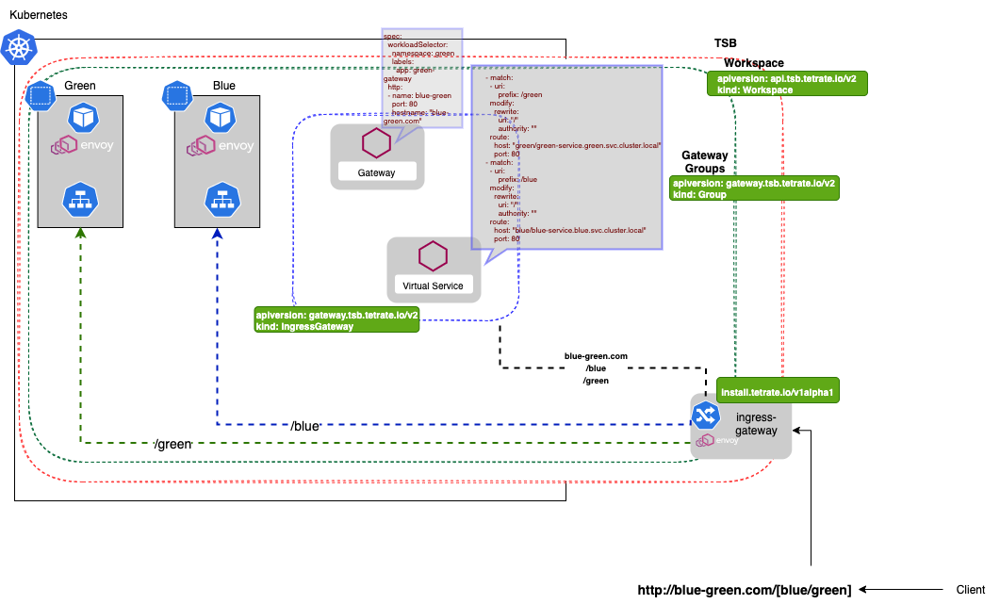

# Istio and TSB inter-namspace service routing
## Introduction
Currently deployed to work on minikube and k8s version  1.19.15
This demostrates the possiblity of internamspace service routing with a single ingress-gateway to leverage path-based routing to distribute traffic to the required target service.


### Setup
Ensure the folowing is installed and available
- kubernetes-cli 
`Client Version: v1.21.1`
- tctl downloaded and installed from [here](https://binaries.dl.tetrate.io/public/raw/)
- Kubectx from [here](https://github.com/ahmetb/kubectx)
Example
```
# version 1.4.0 +
curl -Lo ~/.tctl/bin/tctl https://binaries.dl.tetrate.io/public/raw/versions/darwin-amd64-1.4.0-EA7/tctl
export PATH=$PATH:~/.tctl/bin
```
### Deployment
1. Create .env file and ensure the following are populated
```
# copy the .env.example file to .env
cp .env.example .env
```
2. Deployment test on istio
```
make istio-check
```
3. Deployment test on TSB
```
make tsb-check
```
4. To destroy
```
make destroy
```
